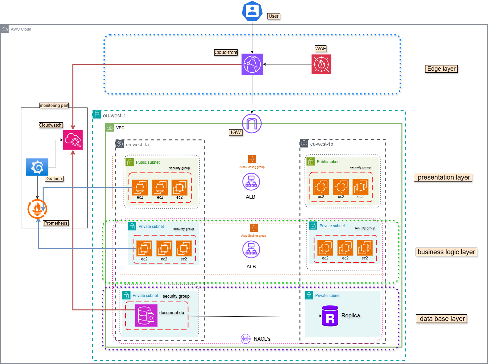

# 🌐 Multi-Tier Web Application with ServerBased Architecture Using IaC (Terraform)

This repository delivers a complete **Infrastructure as Code (IaC)** implementation to provision and manage a **multi-tier EC2-based application on AWS**, using **modular Terraform**, **CloudWatch monitoring**, **Prometheus + Grafana**, and **CI/CD automation**. The architecture follows production-grade patterns for scalability, availability, and secure networking.

---

## 📐 Architecture Overview

The infrastructure is logically divided into 4 main layers:

### 🔹 1. Edge Layer
- **Amazon CloudFront**: Caches and delivers user-facing content globally
- **AWS WAF**: Protects applications from common exploits like SQL injection and XSS

### 🔹 2. Presentation Layer
- **EC2 Instances in Public Subnets**: Serve frontend applications or public services
- **Auto Scaling Group (ASG)**: Automatically provisions EC2 instances based on load
- **Application Load Balancer (ALB)**: Distributes incoming traffic across EC2s

### 🔹 3. Business Logic Layer
- **EC2 Instances in Private Subnets**: Run backend services and APIs
- **Auto Scaling Group (ASG)**: Dynamically manages EC2 instance count based on demand
- **Internal ALB**: Handles secure, internal service-to-service communication

### 🔹 4. Database Layer
- **Amazon DocumentDB**: Deployed in private subnets as a managed MongoDB-compatible service
- **Replica**: Provides high availability and read scalability
- **NACLs + Security Groups**: Enforce strong access control and isolation

---

### 📊 Monitoring & Observability

- **CloudWatch**: Monitors AWS services, collects logs and metrics
- **Prometheus**: Scrapes application-level and EC2-level metrics
- **Grafana**: Visualizes dashboards and alerts for full-stack observability

---

### 📸 Architecture Diagram



---

## 📁 Repository Structure

```bash
.
├── architecture/                  # Architecture image and description
│   ├── Severbased.png
│   └── README.md
├── modules/                       # Terraform modules
│   ├── edge_layer/                # CloudFront and WAF
│   ├── presentation/              # Public EC2 + ASG + ALB
│   ├── business_logic/            # Private EC2 + ASG + ALB
│   ├── database/                  # DocumentDB + replica
│   ├── monitoring/                # Prometheus, Grafana, CloudWatch
│   ├── network/                   # VPC, Subnets, Routes
│   └── security_groups/           # NACLs and SG definitions
├── global_main.tf                 # Root module composition
├── global_outputs.tf              # Output values
├── global_variables.tf            # Global variable definitions
├── terraform.tfvars               # Actual input values
├── provider.tf                    # AWS provider configuration
├── commands.sh                    # Helper script
└── README.md                      # You're here
````

---

## 🚀 Deployment Guide

### 🔧 Prerequisites

#### System Requirements

* **Terraform v1.3+**
* **AWS CLI**
* **Git**
* **Bash** with `curl` and `wget`

#### AWS Permissions Required

* EC2, VPC, ALB, Auto Scaling, DocumentDB
* IAM, CloudWatch, WAF, CloudFront

---

### 1. Set AWS Credentials

```bash
export AWS_ACCESS_KEY_ID=your_access_key
export AWS_SECRET_ACCESS_KEY=your_secret_key
export AWS_REGION=your_preferred_region
```

---

### 2. Initialize Terraform

```bash
terraform init
```

---

### 3. Format & Validate

```bash
terraform fmt -recursive
terraform validate
```

---

### 4. Deploy Infrastructure

```bash
terraform apply --auto-approve
```

---

### 5. Tear Down Infrastructure

```bash
terraform destroy --auto-approve
```

---

## 📈 Monitoring Stack

* **Prometheus**: Scrapes metrics from EC2 and applications
* **Grafana**: Dashboards for infrastructure and services
* **CloudWatch**: Logs, alarms, and AWS-native metrics

> Setup scripts located in:

```bash
modules/monitoring/install-Prometheus-and-Grafana-Server.sh
```

---

## 🔁 Continuous Integration (Terraform CI)

A **GitHub Actions workflow** (`terraform-ci.yml`) automatically validates your Terraform code and plans changes whenever you push or open a pull request to the `main` branch.

### CI Workflow Includes:

* ✅ Code checkout
* ✅ Terraform installation
* ✅ `terraform init`
* ✅ `terraform validate`
* ✅ `terraform fmt -check`
* ✅ `terraform plan`

It uses **GitHub Secrets** to inject AWS credentials and region:

```yaml
env:
  AWS_ACCESS_KEY_ID: ${{ secrets.AWS_ACCESS_KEY_ID }}
  AWS_SECRET_ACCESS_KEY: ${{ secrets.AWS_SECRET_ACCESS_KEY }}
  AWS_REGION: ${{ secrets.AWS_REGION }}
```

> The CI ensures all infrastructure changes are **safe, validated, and formatted** before being applied.

---

## 📑 Useful Commands

### 🔍 Check EC2 Cloud-Init Logs

```bash
sudo cat /var/log/cloud-init-output.log
```

### 🛠️ Terraform Automation Shortcuts

```bash
terraform apply --auto-approve
terraform destroy --auto-approve
terraform fmt -recursive
```

---

## 🧑‍💻 Author

**Moamen Ahmed**

📧 Email: [moamenahmed800@gmail.com](mailto:moamenahmed800@gmail.com)
